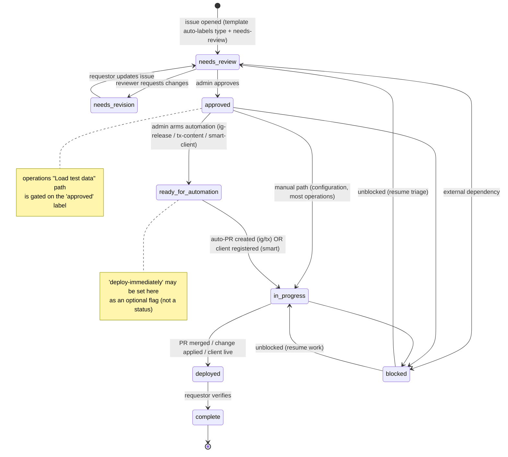

# Sparked FHIR Server - Service Catalogue

Every change to the Sparked FHIR Server is requested as a structured GitHub issue. This
catalogue is the menu of what you can request, what each request does, how long it takes,
and what happens after you submit. Pick the offering that matches your need, click **Raise
request**, and fill in the form.

**Overall SLA posture:** best-effort for non-production environments. Production changes
must be tested in dev/staging first, and all deployments must be verified by the requestor.
As a best practice (not a hard SLA), an admin acknowledges new requests within 24 hours.

---

## How to use this catalogue

1. Find the offering below that matches what you need.
2. Click its **Raise request** link. This opens a pre-filled issue form.
3. Fill in the form. Non-technical requestors can fill in what they can; the team helps
   with the technical fields.
4. Watch the labels on your issue. They track your request through the [lifecycle](#request-lifecycle).
5. When the request reaches `deployed`, test it and confirm on the issue so it can be
   marked `complete`.

Blank issues are disabled. If nothing here fits (a bug, a question, an idea, or a
rollback), use the **General / Bug / Question** offering.

---

## Offerings

| Offering | What it's for | Audience | Automation | Target SLA | Raise request |
|----------|---------------|----------|------------|------------|---------------|
| [Implementation Guide Release](#implementation-guide-release) | Add, update, or roll back a FHIR IG on the server nodes | Anyone (team assists) | Semi-automated | 1 to 2 weeks | [Raise request](https://github.com/aehrc/sparked-fhir-server-configuration/issues/new?template=01-ig-release-request.yml) |
| [Configuration Change](#configuration-change) | Change Smile CDR modules, endpoints, security, or settings | Anyone (team assists) | Manual | 1 to 3 weeks | [Raise request](https://github.com/aehrc/sparked-fhir-server-configuration/issues/new?template=02-configuration-change.yml) |
| [Operational Request](#operational-request) | Load test data, expunge, refresh, restart, backup/restore | Operators & testers | Semi-automated (test-data load) | Hours to days | [Raise request](https://github.com/aehrc/sparked-fhir-server-configuration/issues/new?template=03-operational-request.yml) |
| [Terminology Content Change](#terminology-content-change) | Add/remove/modify IG packages on tx.dev / tx.hl7 | Technical requestors | Semi-automated | 1 to 2 weeks | [Raise request](https://github.com/aehrc/sparked-fhir-server-configuration/issues/new?template=04-tx-content-change.yml) |
| [SMART App / OIDC Client Registration](#smart-app--oidc-client-registration) | Register a SMART on FHIR or backend OIDC client | App/backend developers | Semi-automated | 1 to 3 business days | [Raise request](https://github.com/aehrc/sparked-fhir-server-configuration/issues/new?template=05-smart-app-registration.yml) |
| [General / Bug / Question](#general--bug--question) | Anything not covered above, including rollback | Everyone | Manual (triage) | Best-effort | [Raise request](https://github.com/aehrc/sparked-fhir-server-configuration/issues/new?template=06-general-request.yml) |

---

## Offering detail

### Implementation Guide Release

Deploy a new or updated FHIR Implementation Guide (new IG, version update, or rollback) to
the Sparked FHIR Server nodes.

- **Audience:** technical and non-technical requestors. Non-technical users can fill in
  what they can; the team completes the technical details.
- **Required inputs:** IG name, IG version, NPM package ID, urgency, request type.
- **Optional inputs:** IG documentation URL, custom package `.tgz` URL, target nodes
  (aucore / ereq / hl7au), immediate-deployment preference, test-data/examples needs, and
  package install options.
- **Fulfilment:** automated validation runs a dry-run and posts a preview comment. An admin
  gates the request by adding `ready-for-automation`, which triggers an automated PR that
  edits the package and Terraform config. A human reviews and merges the PR. If
  `deploy-immediately` was requested, deployment runs automatically after merge; otherwise
  the team deploys on a schedule.
- **Automation level:** semi-automated (validate then auto-PR then human merge then optional
  auto-deploy).
- **SLA:** 1 to 2 weeks end-to-end (calendar lead time); roughly 20 minutes of hands-on time
  once `ready-for-automation` is applied. Add 1 to 2 weeks if an ADR is required.
- **Example:** "Deploy IPS 2.0.1 to aucore and hl7au, deploy immediately."

### Configuration Change

Change the Smile CDR server configuration: FHIR modules, endpoints, security/access control,
database configuration, or performance tuning.

- **Audience:** technical and non-technical requestors, focused on describing intent rather
  than implementation.
- **Required inputs:** type of change, current state, desired state, business justification,
  urgency, testing/verification plan, stakeholders/approvers.
- **Optional inputs:** technical detail (files to modify), impact analysis, dependencies,
  rollback plan.
- **Fulfilment:** the request is reviewed and (if significant) may require an ADR. An admin
  implements the change by hand, tests it, and verifies with the requestor. There is no
  auto-PR for configuration changes.
- **Automation level:** manual (an automated welcome comment and priority label are the only
  automation).
- **SLA:** 1 to 3 weeks depending on complexity. Add 1 to 2 weeks if an ADR is required.
- **Example:** "Enable FHIR subscriptions on the ereq node."

### Operational Request

Run operational tasks such as loading test data, expunging/deleting data, refreshing an
environment, migrating data, restarting a server, or backup/restore.

- **Audience:** operators and testers.
- **Required inputs:** operation type, urgency, operation details, frequency, business
  justification, safety confirmation, verification plan, stakeholders/notification.
- **Optional inputs:** resource types and scope, data source (for loads), timing
  constraints, rollback/recovery plan, automation request.
- **Fulfilment:** only **Load test data** is automated: once an admin adds `approved`, the
  test-data load runs automatically. All other operations (expunge, delete, restart, etc.)
  are handled by hand after review.
- **Automation level:** semi-automated for test-data loads; manual otherwise.
- **SLA:** hours to days depending on data volume; test-data loads take roughly 10 to 30
  minutes of run time once `approved`.
- **Example:** "Load 50 test patients into aucore for connectathon testing."

### Terminology Content Change

Add, remove, or modify the IG packages watched on the Sparked terminology servers (tx.dev /
tx.hl7) via atomio-ig-feeder.

- **Audience:** technical requestors familiar with FHIR package concepts (package IDs,
  package-list.json, version modes, Atomio feeds).
- **Required inputs:** action type, package ID, version mode, urgency, business
  justification.
- **Optional inputs:** target terminology server(s), package-list.json URL, display name,
  release statuses to include, pinned versions, Atomio feed name.
- **Fulfilment:** automated validation runs a dry-run and posts a preview. An admin adds
  `ready-for-automation`, which triggers an automated PR editing the terminology helm values.
  A human merges the PR; the atomio-ig-feeder picks up the change on its next sync cycle.
- **Automation level:** semi-automated (validate then auto-PR then human merge then feeder
  sync).
- **SLA:** target 1 to 2 weeks; the live effect depends on the feeder's next sync after merge.
- **Example:** "Watch hl7.fhir.au.core trial-use versions on tx.dev."

### SMART App / OIDC Client Registration

Register a SMART on FHIR public (PKCE) client or a backend confidential (OIDC) client on the
server nodes.

- **Audience:** app and backend developers comfortable with OAuth2 (scopes, redirect URIs,
  FHIR resource IDs).
- **Required inputs:** client ID, client name, client type, scopes, contact email, urgency,
  business justification.
- **Optional inputs:** target nodes, redirect URIs (required in practice for SMART App
  Launch), Practitioner and Patient launch-context resource IDs.
- **Fulfilment:** an admin reviews and adds `ready-for-automation`, which registers the
  client live on each target node. There is no PR. On success the issue receives
  `auto-registered` and endpoint details are posted; on failure it receives
  `needs-manual-intervention`.
- **Automation level:** semi-automated (human gate then live registration).
- **SLA:** registration itself takes about 5 minutes once approved; overall target 1 to 3
  business days to approval.
- **Example:** "Register a public PKCE client `beda-emr` with patient/*.read on aucore."

### General / Bug / Question

Report a bug, ask a question, request an enhancement, or anything not covered by a specific
offering (including rollback). This is the safety net now that blank issues are disabled.

- **Audience:** everyone.
- **Required inputs:** request category, summary, details.
- **Optional inputs:** impact, priority, contact.
- **Fulfilment:** triaged by an admin, who applies the right labels (for example swapping
  `question` for `bug` or `enhancement`) and routes the work.
- **Automation level:** manual (triage only).
- **SLA:** best-effort; an admin acknowledges within roughly 24 hours (not a hard SLA).
- **Example:** "Rollback AU Core 2.1.0-draft on aucore, it broke validation."

---

## Request lifecycle

Every issue moves through a label-driven lifecycle. The template auto-applies the request
type and `needs-review` on open. Automation and admins move it forward from there.

| State | Meaning | Who acts |
|-------|---------|----------|
| `needs-review` | Awaiting triage/technical review (auto-applied on open) | Admin |
| `needs-revision` | Returned to the requestor for changes before review continues | Requestor |
| `approved` | Approved to proceed; also the gate for the test-data load path | Admin |
| `ready-for-automation` | Approved specifically for automation; the gate automation watches | Admin |
| `in-progress` | PR created, work underway, or client being registered | Automation / Admin |
| `deployed` | Change applied; awaiting requestor verification | Automation / Admin |
| `complete` | Verified and closed | Requestor confirms, Admin closes |
| `blocked` | Waiting on an external dependency (orthogonal to the states above) | Admin |

`deploy-immediately` is a **flag**, not a lifecycle state: it is a requestor preference that
tells the automation to deploy an IG release as soon as the PR merges.

---

## Label legend

Colours are reused across meanings, so **disambiguate by name, not colour**.

**Request type** (one auto-applied per template): `ig-release`, `configuration`,
`operations`, `tx-content`, `smart-client`.

**Status / lifecycle:** `needs-review`, `needs-revision`, `approved`, `in-progress`,
`deployed`, `complete`, `blocked`.

**Priority:** `priority:critical`, `priority:high`, `priority:medium`, `priority:low`.

**Automation gates / states:** `ready-for-automation`, `auto-pr-created`, `auto-registered`,
`needs-manual-intervention`, `deploy-immediately`.

**General / triage:** `bug`, `enhancement`, `question`, `documentation`, `duplicate`,
`wontfix`, `automation`.

> **Known colour collisions (disambiguate by name):**
> `approved` and `ready-for-automation` share green (`0e8a16`); `deployed` and `complete`
> share green (`28a745`); `deploy-immediately`, `blocked`, `priority:high`, and
> `needs-manual-intervention` share red (`d93f0b`); `needs-review` and `priority:medium`
> share yellow (`fbca04`).

The labels are version-controlled in [`.github/labels.yml`](../.github/labels.yml) and kept
in sync by [`.github/workflows/sync-labels.yml`](../.github/workflows/sync-labels.yml)
(non-destructive: labels not listed there are never deleted). Do not rename the trigger
labels listed at the top of `labels.yml`, or the automation will break.

---

## What happens after you submit

1. **Welcome comment.** On open, automation posts a next-steps comment and auto-applies a
   priority label based on the urgency you selected.
2. **Validation preview** (IG Release and Terminology Content only). Automation runs a
   dry-run and posts a validation and preview comment. On success it removes `needs-review`.
3. **Human gate.** An admin reviews and, when ready, adds `approved` (test-data loads) or
   `ready-for-automation` (IG / terminology / SMART client).
4. **Automated action.**
   - IG Release and Terminology Content: an automated PR is created and labelled
     `auto-pr-created`; a human reviews and merges it.
   - SMART Client: the client is registered live on the target nodes (no PR).
   - Test-data load: the load runs automatically.
5. **Deploy.** For IG releases, deployment runs automatically if `deploy-immediately` was set;
   otherwise the team deploys on schedule. The issue is labelled `deployed`.
6. **Verify.** You test the change and confirm on the issue so it can be marked `complete`.

Configuration Changes and non-test-data Operations are handled manually end-to-end; they do
not produce an automated PR.

---

## Admin note: project board

Newly opened issues are added to the **Sparked FHIR Server - Service Catalogue** GitHub
Project by [`.github/workflows/add-to-project.yml`](../.github/workflows/add-to-project.yml).
The board's single-select **Status** field mirrors the lifecycle above (`Needs review` ->
`Needs revision` -> `Approved` -> `Ready for automation` -> `In progress` ->
`Deployed (verifying)` -> `Complete` -> `Blocked`).

Automation writes the labels; humans move the board. Group the board by Status for WIP and
bottleneck visibility, by Offering for demand mix, or filter to
`priority:critical`/`priority:high` for the escalation queue.

**Activate the board automation** (one-time, admin):

1. Create the project: `gh project create --owner aehrc --title "Sparked FHIR Server - Service Catalogue"`.
2. Set the repo variable `CATALOGUE_PROJECT_URL` to the project URL
   (Settings -> Secrets and variables -> Actions -> Variables).
3. Set the repo secret `ADD_TO_PROJECT_PAT` to a token with Projects read/write
   (classic PAT with `project` + `repo`, or a fine-grained token with Projects: read/write
   and Issues: read). The default `GITHUB_TOKEN` cannot write to Projects (v2).

The workflow is inert until both the variable and the secret are set.
