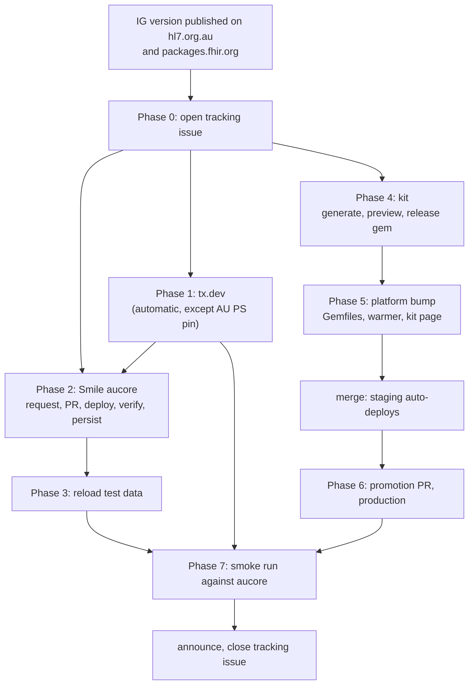

# Runbook: releasing a new IG version to Sparked

How a newly published HL7 AU Implementation Guide version reaches every Sparked target:
the Sparked Dev FHIR Server, the tx.dev terminology server, the Inferno test kits and
platform (staging and production), and the test data on the server.

| | |
|---|---|
| **Track each release in** | one [IG Release Tracking issue](../../.github/ISSUE_TEMPLATE/07-ig-release-tracking.md) per IG version ([open one](https://github.com/aehrc/sparked-fhir-server-configuration/issues/new?template=07-ig-release-tracking.md)) |
| **Last verified** | 2026-09-25, against `main` of this repo, the default branches of `hl7au/au-fhir-inferno`, `au-fhir-core-inferno`, `au-ps-inferno` and `inferno_suite_generator`, `main` of `aehrc/sparked-argo` (private), and the live services named below. Commands marked "verified" were run that day; anything not verified is marked **(unverified)** inline. |
| **Typical elapsed time** | 10 to 12 days from publication to production Inferno for the last two AU Core cycles; the Smile server alone took 1 and 7 days in those cycles, and 18 days for AU Core 2.0.0 (see [History](#history)). |

## Contents

- [1. Purpose and scope](#1-purpose-and-scope)
- [2. Roles](#2-roles)
- [3. The flow at a glance](#3-the-flow-at-a-glance)
- [4. Ordering constraints](#4-ordering-constraints)
- [5. Before you start](#5-before-you-start)
- [6. Procedure](#6-procedure)
  - [Phase 0: Detect and open the tracking issue](#phase-0-detect-and-open-the-tracking-issue)
  - [Phase 1: tx.dev terminology server](#phase-1-txdev-terminology-server)
  - [Phase 2: Sparked Dev FHIR Server (Smile CDR, aucore)](#phase-2-sparked-dev-fhir-server-smile-cdr-aucore)
  - [Phase 3: Test data](#phase-3-test-data)
  - [Phase 4: Test kit (gem)](#phase-4-test-kit-gem)
  - [Phase 5: Inferno platform, staging](#phase-5-inferno-platform-staging)
  - [Phase 6: Inferno platform, production](#phase-6-inferno-platform-production)
  - [Phase 7: Smoke run, announce, close](#phase-7-smoke-run-announce-close)
- [7. Done means](#7-done-means)
- [8. Gotchas reference](#8-gotchas-reference)
- [9. Rollback](#9-rollback)
- [10. Automation backlog](#10-automation-backlog)
- [History](#history)

---

## 1. Purpose and scope

A new IG version (draft, ballot, preview or trial-use) is published by HL7 AU at
`hl7.org.au`. Sparked has to make that version usable in four places, owned across seven
repositories in two GitHub organisations. Nothing links those steps today except this
runbook and the tracking issue, so the runbook states the order, the exact action, the
check that proves each step worked, and the ways each step has failed before.

### Which IG reaches which target

| IG (package id) | Smile `aucore` | tx.dev | Inferno kit | Test data |
|---|---|---|---|---|
| AU Base (`hl7.fhir.au.base`) | yes | yes, automatic | no kit of its own (AU Core depends on it) | only if AU Core test data changes with it |
| AU Core (`hl7.fhir.au.core`) | yes | yes, automatic | `hl7au/au-fhir-core-inferno` | yes |
| AU Patient Summary (`hl7.fhir.au.ps`) | yes | yes, **pinned: manual edit** | `hl7au/au-ps-inferno` | if the AU PS examples change |
| International Patient Summary (`hl7.fhir.uv.ips`) | yes | no | no | no |
| AU eRequesting (`hl7.fhir.au.ereq`) | **no** (the `ereq` node was decommissioned on 2026-08-02, #85 and #87) | yes, automatic | no | no |

The authoritative lists are `package_registry.startup_installation_specs` for `aucore` in
[`module-config/simplified-multinode.yaml`](../../module-config/simplified-multinode.yaml)
and the `watches` in
[`terminology-servers/tx-dev-helm-values.yaml`](../../terminology-servers/tx-dev-helm-values.yaml).
If this table disagrees with those files, the files win; fix the table.

### Targets

| Target | What it is | Changed through |
|---|---|---|
| Sparked Dev FHIR Server | Smile CDR node `aucore`, `https://smile.sparked-fhir.com/aucore/fhir/DEFAULT` | this repo: IG Release request, `Re/load IG Packages` workflow, Terraform |
| tx.dev | Ontoserver at `https://tx.dev.hl7.org.au/fhir`, fed by the Atomio feed `hl7au-dev` on `synd.ontoserver.csiro.au` | this repo: `terminology-servers/tx-dev-helm-values.yaml`, read by fhir-ig-feeder (`aehrc/fhir-ig-feeder`, private) |
| Inferno test kits | Ruby gems `au_core_test_kit` and `au_ps_inferno` on RubyGems | `hl7au/au-fhir-core-inferno`, `hl7au/au-ps-inferno` |
| Inferno platform | staging `https://development.inferno.sparked-fhir.com`, production `https://inferno.hl7.org.au` | `hl7au/au-fhir-inferno`, deployed by ArgoCD from `aehrc/sparked-argo` (private) |
| Test data | the AU FHIR test data set loaded onto `aucore` | `hl7au/au-fhir-test-data`, loaded by this repo's `Manage Test Data` workflow |

### Out of scope: hand-offs only

- **`fhir.hl7.org.au`**, the HL7 AU reference FHIR server, and **tx.hl7**
  (`synd.tx.hl7.org.au`), the HL7 AU reference terminology server. Both are HL7-hosted.
  Any change needs the `needs:hl7-approval` label and Brett Esler's sign-off
  ([Environment scrutiny](../SERVICE-CATALOGUE.md#environment-scrutiny)). The tx-hl7
  feeder is not deployed (removed from ArgoCD in `aehrc/sparked-argo` #72), so tx.hl7
  content is not changed from here at all. The runbook's only step is to tell the owner
  (Phase 7).
- **Authoring or publishing the IG.** That is HL7 AU's process; this runbook starts after
  publication.

## 2. Roles

One person can hold several roles. The "today" column is who has done the step in the last
three cycles, so a new engineer knows who to ask.

| Role | Does | Today |
|---|---|---|
| **Release lead** | Opens and drives the tracking issue, owns Phases 0, 1, 2, 5 to 7 | @KyleOps |
| **Requester** | Files the Smile IG Release request; says whether test data must change | HL7 AU product team (for example @dt-r) |
| **Repo admin** (this repo) | Reviews the request, arms or bypasses automation, merges, deploys, runs Terraform | @KyleOps |
| **Kit maintainer** | Generates the suite and releases the gem (Phase 4) | @projkov |
| **Platform reviewer** | Reviews `au-fhir-inferno` PRs. The `master` ruleset needs 1 approving review, code-owner review and a green `quality-control`. A kit bump touches `Gemfile*` and `infra/`, which `CODEOWNERS` gives to the release owners, so one of them must approve it. | @KyleOps or @brettesler-ext for a kit bump |
| **HL7 AU approver** | Signs off anything touching `fhir.hl7.org.au` or tx.hl7 | Brett Esler |

## 3. The flow at a glance



Phases 1, 2 and 4 start in parallel once the tracking issue exists. The joins are the
[ordering constraints](#4-ordering-constraints).

## 4. Ordering constraints

Each of these has been broken at least once, or would silently break a later step.

1. **The package must be on `packages.fhir.org` before anything else starts.** Smile
   resolves packages from the registry, and a generated suite names its IG as
   `hl7.fhir.au.core#<version>`, which the validator downloads from the registry. A suite
   generated before registry publication was pointed at a local file instead, and every
   deployed validator failed ("Unable to find/resolve/read -ig", `hl7au/au-fhir-inferno`
   #130).
2. **tx.dev should carry the release before anyone judges validation results.** Both the
   Smile node (`remote_term_svc.base_url`) and the Inferno validator
   (`validator.terminologyServer`) validate terminology against
   `https://tx.dev.hl7.org.au/fhir`. tx.dev only ingests once a day (15:00 UTC).
3. **On Smile, dependencies install before the IG, and coupled IGs ship in one PR.** AU
   Core 3.0.0-ballot1 declares, among others, AU Base 7.0.0-ballot1, `hl7.terminology.r4`
   7.3.0 and `smart-app-launch` 2.2.0; those went out together in #91 and #92. Separate IG PRs also
   conflict on the same three files.
4. **The kit gem must be on RubyGems before the platform's `Gemfile` changes.** Staging and
   production build from `Gemfile`; only preview environments build from `Gemfile.dev`.
5. **In the kit repo, the version bump merges before the tag.** `publish-gem.yaml` refuses a
   release whose tag differs from `version.rb`.
6. **The platform's `inferno_suite_generator` ref must suit every released kit it loads.**
   The generator is a runtime dependency of both kits and is pinned once, in
   `Gemfile.common`.
7. **Smile deployed, test data reloaded and tx.dev caught up before the smoke run** in
   Phase 7; otherwise failures are about the environment, not the kit.
8. **Staging verified before the production promotion PR is merged.** Staging and
   production run the same image, so staging is the last place to catch a bad bump.

## 5. Before you start

- Write access to this repo (to arm automation, merge and run workflows).
- For Phase 2 persistence: AWS SSO access to the Sparked account and the Terraform setup in
  [sparkey-deploy-runbook.md](../sparkey-deploy-runbook.md). That document still describes
  sparkey as the parallel stack; it is now the only one (tracked in #111).
- Write access to `hl7au/au-fhir-inferno` (Phases 5 and 6). Kit repos only if you are the
  kit maintainer.
- `curl` and `jq`. Every check below is a plain HTTPS GET unless it says otherwise.

Set these once per release; every command below uses them:

```bash
PKG=hl7.fhir.au.core          # package id
VER=3.0.0-ballot1             # new version
FHIR=https://smile.sparked-fhir.com/aucore/fhir/DEFAULT
TX=https://tx.dev.hl7.org.au/fhir
PROFILE=http://hl7.org.au/fhir/core/StructureDefinition/au-core-patient   # any profile the IG defines
```

---

## 6. Procedure

Every step lists **Who**, **Where**, **Do**, **Verify** and **What goes wrong**. Tick the
matching box in the tracking issue as you go and paste the evidence (a link or the command
output) into the issue.

### Phase 0: Detect and open the tracking issue

<a id="step-0-1"></a>
#### 0.1 Notice the publication

- **Who:** release lead.
- **Where:** the HL7 AU package feed `https://hl7.org.au/fhir/package-feed.xml`, or the
  IG's `package-list.json` (AU Base `https://hl7.org.au/fhir/package-list.json`; the
  others add `core/`, `ps/` or `ereq/`; IPS is
  `https://hl7.org/fhir/uv/ips/package-list.json`).
- **Do:** check the feed. Nothing watches it for Smile or Inferno today; the tx.dev feeder
  is the only automated consumer.

  ```bash
  curl -s https://hl7.org.au/fhir/package-feed.xml | grep -o '<title>[^<]*</title>'
  ```

- **Verify:** the package is on the registry. Use GET: `packages.fhir.org` answers 404 to
  HEAD (verified).

  ```bash
  curl -s -o /dev/null -w '%{http_code}\n' "https://packages.fhir.org/$PKG/$VER"   # expect 200
  ```

- **What goes wrong:** starting before the registry has the package (constraint 1).

<a id="step-0-2"></a>
#### 0.2 Open the tracking issue and decide the targets

- **Who:** release lead.
- **Where:** [IG Release Tracking](https://github.com/aehrc/sparked-fhir-server-configuration/issues/new?template=07-ig-release-tracking.md).
- **Do:** one issue per IG version. Fill in the fields, tick "applies" for each target using
  the [scope table](#which-ig-reaches-which-target), and record the dependency list:

  ```bash
  curl -sL "https://packages.fhir.org/$PKG/$VER" | tar xzO package/package.json | jq '.dependencies'
  ```

  If a dependency is itself a new version (AU Core 3.0.0-ballot1 declared AU Base
  7.0.0-ballot1), open or link that IG's tracking issue and plan one Smile PR for both.
- **Verify:** the issue exists with the published date filled in (from `package-list.json`
  `date`), so elapsed time can be measured at close.
- **What goes wrong:** a new dependency version missed here surfaces in Phase 2 as a
  profile that loads but validates against the wrong base.

### Phase 1: tx.dev terminology server

<a id="step-1-1"></a>
#### 1.1 Let the feeder pick up the release (or edit the AU PS pin)

- **Who:** release lead.
- **Where:** [`terminology-servers/tx-dev-helm-values.yaml`](../../terminology-servers/tx-dev-helm-values.yaml).
  ArgoCD deploys that file from this repo's `main` (ApplicationSet `fhir-ig-feeders` in
  `aehrc/sparked-argo`), and the feeder polls `https://hl7.org.au/fhir/package-feed.xml`
  every 5 minutes, pushing matches into the Atomio feed `hl7au-dev`.
- **Do:**
  1. **Check the feeder is running.** It has been described as decommissioned for now,
     but on 2026-09-25 it was deployed and pushing (verified). With cluster read access:

     ```bash
     kubectl --context sparkey -n argocd get application fhir-ig-feeder-tx-dev \
       -o jsonpath='{.status.sync.status} {.status.health.status}{"\n"}'    # expect: Synced Healthy
     kubectl --context sparkey -n fhir-ig-feeder-tx-dev get deploy fhir-ig-feeder-tx-dev-fhir-ig-feeder \
       -o jsonpath='{.status.readyReplicas}/{.spec.replicas} ready{"\n"}'  # expect: 1/1 ready
     ```

     If either command says `NotFound`, or the deployment shows `0/`, nothing in this
     step reaches tx.dev. Stop and ask the release lead. The pre-feeder fallback is adding
     the entry by hand in the Atomio UI at `https://synd.ontoserver.csiro.au`, feed
     `hl7au-dev` **(unverified: not exercised since the feeder went live on 2026-07-05)**.
  2. **AU Base, AU Core, AU eRequesting:** nothing more. They are `versionMode: latest-any`
     with statuses `[ballot, preview, draft, trial-use]`, so the single newest version is
     taken automatically. (`latest-any` is missing from the mode table in
     [terminology-servers/readme.md](../../terminology-servers/readme.md); it means "the one
     newest version across all listed statuses".)
  3. **AU PS:** `versionMode: pinned`, `versions: [1.0.0]`, `statuses: [trial-use]`. In a
     PR, add the new version under `versions`, and add its status under `statuses` if it
     is not `trial-use`, or it will never match. Edit the YAML by hand. Do not use
     `scripts/update_tx_helm_values.py` or a
     [Terminology Content Change](https://github.com/aehrc/sparked-fhir-server-configuration/issues/new?template=04-tx-content-change.yml)
     request for this: both run that script, which reads `feeds` at the top level of the
     file while the feeder layout nests them under `targets[].feeds`, so it exits with
     `Error: Feed 'hl7au-dev' not found in values file` (verified with `--dry-run` on
     2026-09-25). The 1.0.0 bump was committed straight to `main` (0944fa2); do not repeat
     that.
- **Verify:** within a poll cycle (5 minutes) the feeder logs the package. With cluster
  read access:

  ```bash
  kubectl --context sparkey -n fhir-ig-feeder-tx-dev logs deploy/fhir-ig-feeder-tx-dev-fhir-ig-feeder --since=15m \
    | grep "$PKG"
  ```

  A new package is logged as added on its first cycle (exact message unverified) and then
  as `"entry already exists, skipping"` with its `version` on every later one (verified).
  The feeder also has a web UI at `https://tx-dev.feeder.sparked-fhir.com`, but its TLS
  certificate expires on 2026-10-03 and its renewal has been stuck since 2026-09-03, so do
  not rely on it.
- **What goes wrong:** the AU PS pin is the known silent miss: the next AU PS release
  never reaches tx.dev unless someone edits it.

<a id="step-1-2"></a>
#### 1.2 Confirm tx.dev has ingested it

- **Who:** release lead.
- **Where:** `https://tx.dev.hl7.org.au/fhir`. Ontoserver pulls the `hl7au-dev` feed once a
  day at **15:00 UTC** (`atom.preload.schedule.cron` in `aehrc/sparked-argo`
  `apps/ontoserver/values.yaml`), so allow up to a day after step 1.1.
- **Do:** wait for the next run. There is no supported manual trigger in this runbook.
- **Verify** (verified): AU Core and AU PS ship no ValueSets of their own, so check a
  StructureDefinition; AU Base also ships ValueSets, which can be checked by `version`.

  ```bash
  curl -s -H 'Accept: application/fhir+json' \
    "$TX/StructureDefinition?url=$PROFILE&version=$VER&_elements=url,version" \
    | jq -r '.entry[]?.resource | "\(.url)|\(.version)"'
  # AU Base only:
  curl -s -H 'Accept: application/fhir+json' "$TX/ValueSet?version=$VER&_elements=url&_count=1" | jq .total
  ```

- **What goes wrong:** judging Smile or Inferno validation results before this passes
  (constraint 2). tx.dev keeps every earlier version too, so always check with `version`.

### Phase 2: Sparked Dev FHIR Server (Smile CDR, aucore)

The request, automation and admin workflow is described in
[WORKFLOWS.md: IG Release Workflow](../WORKFLOWS.md#ig-release-workflow). This phase adds
what that guide leaves implicit.

<a id="step-2-1"></a>
#### 2.1 Raise the IG Release request

- **Who:** requester, or the release lead on their behalf.
- **Where:** [Implementation Guide Release Request](https://github.com/aehrc/sparked-fhir-server-configuration/issues/new?template=01-ig-release-request.yml)
  (`01-ig-release-request.yml`). One request per package; link each from the tracking issue.
- **Do:** request type *Update*, target node `aucore`, and **tick "Request package be
  installed automatically (STORE_AND_INSTALL)"**. Leave "Request dependencies be fetched
  automatically" unticked.
- **Verify:** within a minute `issue-opened.yml` posts "Automated Validation & Preview" with
  **Install Mode: STORE_AND_INSTALL** and a dry-run that shows the old version being
  replaced.
- **What goes wrong:**
  - The install box is unticked by default and an unticked box writes **STORE_ONLY**, which
    stores the package without installing its conformance resources and quietly stops
    profile validation against the new version. It happened on both ballot requests (#84,
    #86) and was corrected by hand.
  - **`fetchDependencies: true` fetches nothing.** Smile treats a dependency as satisfied
    when any version of that package id is present, so it never upgrades one (tested live,
    #86 and #91). Missing dependency versions are handled in step 2.2.

<a id="step-2-2"></a>
#### 2.2 Review, add missing dependencies, produce the PR

- **Who:** repo admin.
- **Where:** the request issue; `scripts/apply_ig_release.py`.
- **Do:**
  1. Compare the dependency list from step 0.2 with what `aucore` has. The dry-run comment
     lists installed packages; the live registry needs credentials, so the dry-run is the
     practical view.
  2. For each dependency whose exact version is not installed, add it as its own pinned
     package (as #91 and #92 did for `hl7.terminology.r4` 7.3.0 and `smart-app-launch`
     2.2.0), ordered ahead of the IGs in `startup_installation_specs`.
  3. Batch coupled packages (for example AU Base and AU Core ballots) into **one PR**.
  4. Add `ready-for-automation` to produce the PR, or run the same engine locally:

     ```bash
     python scripts/apply_ig_release.py --package-id "$PKG" --version "$VER" \
       --ig-name "AU Core" --nodes aucore \
       --install-mode STORE_AND_INSTALL --fetch-dependencies false
     ```

     The script defaults to `STORE_ONLY` as well, so always pass `--install-mode`.

- **Verify:** the PR replaces the old version in place in
  `module-config/simplified-multinode.yaml` (order unchanged), adds
  `module-config/packages/package-<name>-<version>.json` (for example `package-aucore-3.0.0-ballot1.json`), and updates `values-common.yaml` and
  `terraform/main.tf`. The package JSON says `"installMode": "STORE_AND_INSTALL"`.
- **What goes wrong:** the `ready-for-automation` path (`issue-labeled.yml`, job
  `create-ig-pr`) last completed on 2026-05-11. Every run from 2026-07-28 hit a
  `startup_failure`, fixed in #90, and no IG release has exercised it since
  **(unverified end to end)**. If it fails, run `apply_ig_release.py` locally, which is how
  #91 was produced.

<a id="step-2-3"></a>
#### 2.3 Merge and deploy to the running node

- **Who:** repo admin.
- **Where:** the PR, then **Actions > Re/load IG Packages** (`reload-ig-config.yml`).
- **Do:** merge. If the request had `deploy-immediately`, `pr-merged.yml` triggers the
  deploy. Otherwise run `Re/load IG Packages` with `nodes: aucore`,
  `package_source: config`, **`dry_run: true` first**, then `dry_run: false`, and pass the
  request's `issue_number` so results are posted there.
- **Verify** (verified): the new profile version is present and active, and `$validate`
  resolves it. Use an existing test-data Patient (for example `hennessy-billy`):

  ```bash
  curl -s -H 'Accept: application/fhir+json' \
    "$FHIR/StructureDefinition?url=$PROFILE&_elements=url,version,status" \
    | jq -r '.entry[]?.resource | "\(.version) \(.status)"'

  curl -s -G -H 'Accept: application/fhir+json' "$FHIR/Patient/hennessy-billy/\$validate" \
    --data-urlencode "profile=$PROFILE|$VER" \
    | jq -r '.issue[] | select(.severity=="error" or .severity=="fatal") | .diagnostics'
  ```

  The second command must not print `Invalid profile. Failed to retrieve profile`; that is
  exactly what it prints for a version the node does not have.
- **What goes wrong:**
  - **Old StructureDefinitions linger.** Uninstalling the superseded version does not purge
    its conformance resources: today `au-core-patient` 2.1.0-draft is still active beside
    3.0.0-ballot1 (verified). A version-less canonical can resolve to the old one, so
    always validate with `|<version>` and tell testers to do the same. Cleanup is a
    separate decision (#45).
  - **Replacing a large package's current version triggers a long server-side expunge.** On
    a terminology bump it held the pod near 1 CPU with intermittent 15 s ingress timeouts
    for several minutes; it recovers without a restart (#92). Do not stack another install
    on top while it drains.

<a id="step-2-4"></a>
#### 2.4 Persist the seed config

- **Who:** repo admin.
- **Where:** Terraform from a workstation, on `main` after the PR merged. One-time setup
  (the gitignored `backend-sparkey.hcl` and `tfvars/sparkey.tfvars`) is in
  [sparkey-deploy-runbook.md](../sparkey-deploy-runbook.md). Use that document, not
  `terraform-local-deploy.md`, which describes the decommissioned stack (#111).
- **Do:** plan and apply the Smile deployment so the new package files become ConfigMaps
  and `startup_installation_specs` matches the repo. Pick a window: a `module-config/`
  change rolls the pod, and the first `$validate` after it can answer 504 while the
  validator warms (#111).

  ```bash
  cd terraform
  terraform init -reconfigure -backend-config=backend-sparkey.hcl   # must not prompt for `key`; if it does, stop
  terraform plan -var-file=../tfvars/sparkey.tfvars -out=sparkey.plan
  terraform apply sparkey.plan
  ```

- **Verify:** before applying, the plan changes the Smile Helm release in place and adds,
  changes or destroys no AWS resources; anything else means stop and ask
  **(unverified: this plan was not re-run for this runbook)**. After apply, repeat the step
  2.3 checks. With cluster read access, confirm the live spec equals the repo's (run from
  the repo root; `aucore` is the first node in the file, so `grep -m1` picks its line):

  ```bash
  CM=$(kubectl --context sparkey -n smile get cm -o name | grep scdrnode-aucore)
  diff \
    <(kubectl --context sparkey -n smile get "$CM" -o jsonpath='{.data.cdr-config-Master\.properties}' \
        | grep startup_installation_specs | sed 's/.*= *//') \
    <(grep -m1 startup_installation_specs module-config/simplified-multinode.yaml | sed 's/.*: *"//; s/"$//') \
    && echo "live matches repo"
  ```

- **What goes wrong:** skipping this leaves a node whose next restart reseeds the previous
  versions. The Terraform step itself was not re-run for this runbook **(unverified)**; the
  live spec matched the repo on 2026-09-25.

<a id="step-2-5"></a>
#### 2.5 AU PS only: check the `$summary` generator

- **Who:** repo admin.
- **Where:** `copyFiles` on `aucore` in `simplified-multinode.yaml`, which loads
  `hapi-aups-generator-<version>.jar` from S3 (built in `aehrc/sparked-fhir-operations`,
  private).
- **Do:** ask whether the AU PS release needs a new generator build; if so, follow the #108
  pattern (upload the jar first, then change the path).
- **Verify:** `$summary` output for a test patient validates against the new
  `au-ps-bundle` profile version.
- **What goes wrong:** whether every AU PS IG release needs a generator change has not been
  established **(unverified)**; the jar has only changed for conformance fixes so far.

### Phase 3: Test data

<a id="step-3-1"></a>
#### 3.1 Confirm the test data is ready

- **Who:** requester, with the test data maintainers.
- **Where:** `hl7au/au-fhir-test-data` (default branch; the loader clones it with no branch
  selection).
- **Do:** confirm whether the release needs new or changed test data and that it has
  merged.
- **Verify:** a merged change, or an explicit "no change" recorded on the tracking issue.
- **What goes wrong:** reloading before the data merges reloads the old data.

<a id="step-3-2"></a>
#### 3.2 Reload aucore

- **Who:** repo admin.
- **Where:** **Actions > Manage Test Data** (`manage-test-data.yml`), operation
  `clear-and-load-aucore`. (An Operational Request with `approved` runs a load without the
  clear.)
- **Do:** run with `dry_run: true`, read the summary, then run for real with the tracking
  issue number in `issue_number`. `dry_run` defaults to **false** on this workflow, so set
  it explicitly: the real run wipes the node's data.
- **Verify:** the posted summary shows the file count and 0 failed (or the failures are
  triaged on the issue); `curl -s "$FHIR/Patient/hennessy-billy" -o /dev/null -w '%{http_code}\n'`
  returns 200.
- **What goes wrong:**
  - The clear is a wipe-all with expunge. It does not touch installed IGs: the loader's
    delete list contains no conformance types (verified in `aehrc/sparked-test-data-loader`,
    private).
  - The last two `main` runs of this workflow failed (2026-07-14, 2026-08-24) before fixes
    #103 and #104 merged, and it has not run on `main` since **(unverified end to end)**.
    Run the dry run first.

### Phase 4: Test kit (gem)

AU Core: `hl7au/au-fhir-core-inferno`. AU PS: `hl7au/au-ps-inferno`. Both default to
`master`.

<a id="step-4-1"></a>
#### 4.1 Open the kit issue

- **Who:** release lead.
- **Where:** the kit repo's issues (for example `au-fhir-core-inferno` #300 for
  3.0.0-ballot1).
- **Do:** state the IG version and link, and **which existing suite it replaces on the site**
  (3.0.0-ballot1 replaced 2.1.0-draft).
- **Verify:** linked from the tracking issue.

<a id="step-4-2"></a>
#### 4.2 Generate the suite

- **Who:** kit maintainer.
- **Where:** the kit repo, on a branch.
- **Do (AU Core):** the `Generate Tests` workflow is not the working path (last run
  2026-01-29; it opens its PR with `GITHUB_TOKEN`, so CI does not run on that PR). The
  3.0.0-ballot1 suite was generated by hand (#301), which touched:
  - `config.<ver>.json` (for example `config.300-ballot1.json`), with
    `ig.package_archive_path` pointing at `lib/au_core_test_kit/igs/<ver>.tgz`, and that
    archive committed;
  - `Rakefile`: `config_files` in `au_core:generate`;
  - `lib/au_core_test_kit.rb`: `require_relative` for the new `generated/v<ver>/` suite;
  - `Makefile`: `generated_v2_path`, which is hardcoded to the version being regenerated
    (today still `v2.1.0-draft/`). `make generate` starts with `rm -rf` of that path, so
    point it at the new version first or it deletes the 2.1.0-draft suite;
  - `Gemfile` / `Gemfile.lock` (generator revision) and `CHANGELOG.md`.

  Then run `make generate` (Docker) or `make generate_local`.
- **Do (AU PS):** put the `.tgz` in `lib/au_ps_inferno/igs/`, point `ig.package_archive_path`
  in `inferno_suite_generator.config.json` at it, and run `Generate Suite`
  (`generate-suite.yaml`). The kit README says to edit the path in the `Rakefile`, but the
  `generator:generate` task no longer holds one; the generator reads the config file.
  The suite names its IG from `IG_VERSION` in `lib/au_ps_inferno/version.rb`
  (`igs "hl7.fhir.au.ps##{AUPSTestKit::IG_VERSION}"`), which the generator updates. A newer
  `Sync IG Package` workflow (`sync-ig-package.yaml`) fetches the latest package from the
  registry and opens the PR itself, but it had no runs as of 2026-09-25, so treat it as
  untested, and it also opens
  its PR with `GITHUB_TOKEN`. Whether a new AU PS IG version gets a new suite id or
  replaces `au_ps_v100` is the kit maintainer's call **(unverified)**; Phase 5 must follow
  it.
- **Verify:** the new suite names its IG by **package id**, never a file path:

  ```bash
  git grep -n "igs '" lib/au_core_test_kit/generated/     # AU Core
  git grep -n 'igs "' lib/au_ps_inferno/                  # AU PS
  ```

  Every line must read like `igs 'hl7.fhir.au.core#3.0.0-ballot1'`. Any `/home/igs/...` path
  fails on every deployed validator.
- **What goes wrong:**
  - **The `/home/igs` path.** `/home/igs` exists only under local Docker Compose, where
    `compose.yaml` mounts `igs/` there. `rewrite_igs` in a `config.*.json` re-injects it on
    every regeneration. As of 2026-09-25, `config.100.json` and `config.200.json` still
    carry `rewrite_igs`, and `master`'s regenerated v1.0.0 suite (#316, after the v1.4.6
    tag) reads `igs '/home/igs/1.0.0.tgz'`. The next gem release would ship that unless it
    is fixed first.
  - Generating before registry publication (constraint 1).

<a id="step-4-3"></a>
#### 4.3 Preview the kit

- **Who:** kit maintainer.
- **Where:** the kit PR. The `kit-previews` ApplicationSet in `aehrc/sparked-argo` builds an
  environment for every open PR labelled `preview` on either kit repo.
- **Do:** add the `preview` label.
- **Verify:** the bot comment turns live and the new suite runs at
  `https://aucore-pr-<n>.preview.inferno.sparked-fhir.com` (AU PS: `aups-pr-<n>`). Record a
  session link, as #301 did.
- **What goes wrong:** a label applied right after opening the PR can take up to about two
  minutes to be noticed (the webhook arrives before GitHub's API shows the label).
  Previews hold one validator session (`sessionCacheSize: 1`), so switching suites costs
  about 50 s of cold build each time.

<a id="step-4-4"></a>
#### 4.4 Release the gem

- **Who:** kit maintainer.
- **Where:** the kit repo; `publish-gem.yaml` runs on `release: published`.
- **Do, in this order:**
  1. PR that bumps `VERSION` in `lib/au_core_test_kit/version.rb` (AU PS:
     `lib/au_ps_inferno/version.rb`, `AUPSTestKit::VERSION`), the kit's own entry in its
     `Gemfile.lock`, and `CHANGELOG.md`. Merge it.
  2. Create tag `vX.Y.Z` on that merge commit and a GitHub Release from it.
- **Verify:**

  ```bash
  gh run list --repo hl7au/au-fhir-core-inferno --workflow publish-gem.yaml -L 1
  curl -s https://rubygems.org/api/v1/versions/au_core_test_kit/latest.json | jq -r .version   # au_ps_inferno for AU PS
  ```

  Record which `inferno_suite_generator` revision the release was built with; step 5.1
  needs it:

  ```bash
  git show vX.Y.Z:Gemfile.lock | grep -A2 inferno_suite_generator.git
  ```

- **What goes wrong:** tagging before the bump merges makes the "Verify tag matches gem
  version" step fail; v1.3.1 and v1.4.0 each needed a second run for a reason like this
  (the logs have expired, so the cause is inferred). RubyGems refuses to overwrite a
  published version, so a bad release is fixed forward with a new patch version.

### Phase 5: Inferno platform, staging

`hl7au/au-fhir-inferno`, default branch `master`. Background:
[dev-workflow.md](https://github.com/hl7au/au-fhir-inferno/blob/master/docs/dev-workflow.md).

<a id="step-5-1"></a>
#### 5.1 Bump the platform: four places that must agree

- **Who:** kit maintainer or release lead; reviewed by a platform reviewer.
- **Where:** one PR on `au-fhir-inferno`. Add the `preview` label (preview URL
  `https://pr-<n>.preview.inferno.sparked-fhir.com`).
- **Do:** change all of these together. Nothing in CI checks that they agree.

  | # | File | Change |
  |---|---|---|
  | 1 | `Gemfile` + `Gemfile.lock` | `gem 'au_core_test_kit', '~> X.Y.Z'` (or `au_ps_inferno`), then `bundle lock`. Staging and production build from this pair. |
  | 2 | `Gemfile.dev` + `Gemfile.dev.lock` | Same version (today `'>= X.Y.Z'`). Previews build from this pair; `quality-control` checks it resolves frozen. |
  | 3 | `infra/helm/inferno/values.yaml`, `warmer` | Add the new suite id to `warmer.auCoreSuites` (AU PS: `auPsSuiteId`, `auPsProfile`) and drop the one it replaces. |
  | 4 | `web/_test_kits/au-core.md` (or `au-ps.md`) front matter | Add the suite to `suites` (first entry is preselected), drop the replaced one, set `version:` to the gem version and `date:` to the release date. |

  And check the shared pin: `inferno_suite_generator` `ref:` in `Gemfile.common`.
- **Verify:** `quality-control` is green; on the preview,

  ```bash
  curl -s https://pr-<n>.preview.inferno.sparked-fhir.com/suites/api/test_suites \
    | jq -r '.[] | select(.id | startswith("au_")) | "\(.id) \(.version)"'
  ```

  lists the new suite at the new gem version, and one run of it completes. The AU PS suite
  reports `version: null` there, so for AU PS check the locked gem instead:
  `grep -E '^    au_(core_test_kit|ps_inferno) \(' Gemfile.lock`.
- **What goes wrong:**
  - **Warmer larger than the session cache.** The warmer runs in production only and warms
    every AU Core suite listed plus the AU PS suite. Keep that total at or below production
    `validator.sessionCacheSize` (4, in `values.yaml`), or engines evict each other and a
    suite stays cold anyway. Today it warms 3.
  - **Generator ref mismatch.** Both kits load `inferno_suite_generator` at runtime, neither
    gemspec declares it, and the platform pins it once in `Gemfile.common` (today
    `da378cb`). As of 2026-09-25 the released AU Core kit was built with `33e1b2f`, the
    released AU PS kit with `f4c668d`, and both kit `master` branches now lock `ce03f93`,
    which adds FHIRPath error tracing. The next release of either kit will probably need
    the platform ref moved, and the moved ref must still work with the other kit's released
    gem. Prove it on the preview.
  - **Orphan SHA pins.** If `Gemfile.dev` has to pin an unreleased kit commit, use a commit
    on a branch that will survive. #130 pinned `9790c863`, reachable from no branch,
    which made the git gem fetch fragile and had to be repinned.
  - **The kit page and warmer are hand-maintained.** The gem keeps registering replaced
    suites (production still lists `au_core_v210_draft`); only the page and the warmer
    decide what testers see and what stays warm.

<a id="step-5-2"></a>
#### 5.2 Merge to master; staging deploys itself

- **Who:** platform reviewer merges.
- **Where:** `master` push runs `build-and-release-package.yaml`, which builds one image;
  ArgoCD Image Updater writes the tag into `aehrc/sparked-argo`
  `apps/inferno-dev/image-values.yaml` through an auto-merged PR titled "build: automatic
  update of inferno-dev", and the `inferno-dev` app syncs it.
- **Do:** nothing after the merge.
- **Verify:**

  ```bash
  curl -s https://development.inferno.sparked-fhir.com/suites/api/test_suites \
    | jq -r '.[] | select(.id | startswith("au_")) | "\(.id) \(.version)"'
  ```

  The image write-back lands 3 to 5 minutes after the merge (measured on the last two
  `master` merges); allow a few more for ArgoCD to sync and the pods to roll.
- **What goes wrong:** staging runs `validator.sessionCacheSize: 2` with no warmer, so the
  first run of each suite is slow. That is expected, not a fault.

### Phase 6: Inferno platform, production

<a id="step-6-1"></a>
#### 6.1 Merge the promotion PR

- **Who:** release lead.
- **Where:** the draft PR `Promote prod -> vX.Y.Z` on branch `promote/prod-<sha>` that the
  `master` build opens (for example #207). Process:
  [prod-releases.md](https://github.com/hl7au/au-fhir-inferno/blob/master/docs/prod-releases.md).
- **Do:** confirm the SHA is the one verified on staging. Accept the proposed patch
  version, or set another with a `release:minor` / `release:major` label. Mark ready and
  merge.
- **Verify:** `prod-release.yaml` creates tag `vX.Y.Z` and a GitHub Release and waits for
  `https://inferno.hl7.org.au` to answer 200. Then:

  ```bash
  curl -s https://inferno.hl7.org.au/suites/api/test_suites \
    | jq -r '.[] | select(.id | startswith("au_")) | "\(.id) \(.version)"'
  ```

- **What goes wrong:** each `master` build opens a new promotion PR and closes the older
  open one as superseded (#205 was closed the moment #207 opened), so the open PR always
  carries the newest `master` SHA. That SHA can include commits merged after your bump
  that staging has not been checked with. Read the changelog in the PR body before
  merging, and confirm staging runs that same SHA.

### Phase 7: Smoke run, announce, close

<a id="step-7-1"></a>
#### 7.1 Smoke run against aucore

- **Who:** release lead.
- **Where:** `https://inferno.hl7.org.au`, the new suite.
- **Do:** create a session, set the FHIR endpoint to
  `https://smile.sparked-fhir.com/aucore/fhir/DEFAULT` (the suite defaults to the HL7 AU
  reference server `https://fhir.hl7.org.au/aucore/fhir/DEFAULT`, which may not have the new
  version) and the patient ids from the test data, and run it.
- **Verify:** the run completes, with no `Unable to find/resolve/read -ig` and no validator
  session errors. Failures where the data does not meet the new profile go to the test data
  maintainers; they do not block the release. Paste the session URL into the tracking
  issue.

<a id="step-7-2"></a>
#### 7.2 Hand off the reference environments

- **Who:** release lead.
- **Do:** tell the HL7 AU approver the release is live on Sparked, so the owners of
  `fhir.hl7.org.au` and tx.hl7 can schedule their own update. Record who was told.

<a id="step-7-3"></a>
#### 7.3 Announce and close

- **Who:** release lead.
- **Where:** chat.fhir.org stream `australia`, topic "Inferno Test Kit feedback and
  queries" (linked from the `au-ps-inferno` README), and the Sparked team's own channel.
- **Do:** post what is live where: Smile node version, tx.dev, the suite id and gem
  version, and the Inferno release. Then close the tracking issue with the elapsed days
  from publication.
- **Verify:** the announcement link is on the tracking issue; the kit issue and the Smile
  request issues are closed (#300 stayed open a month after its release).

---

## 7. Done means

A release is done when every applicable row is true and the evidence is linked on the
tracking issue:

- **Smile:** `aucore` lists the new profile version as `active`; `$validate` with
  `profile=<url>|<version>` resolves; the repo seed config matches the live node; the
  request issues are closed.
- **tx.dev:** `StructureDefinition?url=<profile>&version=<version>` returns the resource.
- **Test data:** reloaded after the data merged, with failures triaged, or "no change"
  recorded.
- **Kit:** gem `X.Y.Z` is on RubyGems; its GitHub Release exists; the kit issue is closed.
- **Platform:** production `/suites/api/test_suites` lists the new suite at `X.Y.Z`; the
  kit page shows it; the warmer list is within the cache size; the production release
  `vX.Y.Z` is tagged.
- **Smoke run** against `aucore` completed, session linked.
- **Hand-off** to the reference environment owners recorded.
- **Announced**, and the tracking issue closed with elapsed days.

## 8. Gotchas reference

| Gotcha | Bites in | How you notice | Source |
|---|---|---|---|
| Unticked install box writes STORE_ONLY | [2.1](#step-2-1) | preview comment shows `Install Mode: STORE_ONLY` | #84, #86, #91 |
| `fetchDependencies: true` pulls nothing if any version is present | [2.1](#step-2-1), [2.2](#step-2-2) | dependency version absent from the dry-run list | #86, #91, #92 |
| Superseded StructureDefinitions stay active | [2.3](#step-2-3) | version-less search returns two versions | #45; verified 2026-09-25 |
| Large package replacement causes a long expunge and ingress timeouts | [2.3](#step-2-3) | pod CPU pinned, 15 s timeouts, no restart | #92 |
| Live install without Terraform means a restart reseeds old versions | [2.4](#step-2-4) | live `startup_installation_specs` differs from the repo | #91, #111 |
| AU PS pinned on tx.dev | [1.1](#step-1-1) | no feeder log line for the new AU PS version | `tx-dev-helm-values.yaml`; 0944fa2 |
| Suite loads the IG from `/home/igs` | [4.2](#step-4-2) | `igs '/home/igs/...'` in generated code; "Unable to find/resolve/read -ig" | `au-fhir-inferno` #130; `au-fhir-core-inferno` #316 |
| Generation workflows open PRs CI never checks | [4.2](#step-4-2) | no checks on the bot PR | `generate-tests.yaml`, `sync-ig-package.yaml` |
| Tag before version bump | [4.4](#step-4-4) | "Release tag ... does not match gem version" | `publish-gem.yaml`; v1.3.1, v1.4.0 reruns |
| Four platform files drift apart | [5.1](#step-5-1) | suite missing from the page, not warm, or wrong version shown | `au-fhir-inferno` #130, #186 |
| Warmer list larger than `sessionCacheSize` | [5.1](#step-5-1) | slow first runs on production after a restart | `values.yaml` warmer comment |
| One generator ref serves two kits | [5.1](#step-5-1) | `NameError` / missing require at suite load on preview | `Gemfile.common`; kit lockfiles |
| Orphan SHA pin in `Gemfile.dev` | [5.1](#step-5-1) | bundle fails to fetch the git gem | `au-fhir-inferno` #130 (`9790c863`) |
| Promotion PR carries commits you did not check on staging | [6.1](#step-6-1) | PR changelog lists more than your bump | `build-and-release-package.yaml`; #205 superseded by #207 |

## 9. Rollback

- **Smile:** raise an IG Release request with request type *Rollback* to the previous
  version, or run `Re/load IG Packages` with `package_source: custom` and the previous
  version's JSON, then restore the seed config in a PR and apply it. The superseded
  version's StructureDefinitions are likely still present (step 2.3), which makes a
  rollback fast. A rollback has not been exercised for this runbook **(unverified)**.
- **tx.dev:** remove or re-pin the watch. Ontoserver keeps what it has already ingested;
  removing content from tx.dev is not covered here **(unverified)**.
- **Kit:** release a fixed patch version. RubyGems versions are immutable.
- **Platform:** a promotion PR pointing `values-prod.yaml` back at the previous release's
  SHA ([prod-releases.md, Rollback](https://github.com/hl7au/au-fhir-inferno/blob/master/docs/prod-releases.md#rollback)).

## 10. Automation backlog

Each item removes checklist lines, which is better than documenting them.

1. **Watch the package feed and open the tracking issue and Smile request.** fhir-ig-feeder
   already polls `package-feed.xml`; a scheduled Action doing the same could open both
   issues. Removes steps 0.1, 0.2 (mostly) and 2.1.
2. **Make STORE_AND_INSTALL the default and check exact dependency versions** in the IG
   Release form and its dry-run, failing when a declared dependency version is not
   installed. Removes two gotchas and the manual part of step 2.2.
3. **Platform CI assertion** in `au-fhir-inferno` `quality-control`: every suite id in
   `web/_test_kits/*.md` and in the warmer exists in the locked gems, the warmer count is
   at most `sessionCacheSize`, and the page `version:` equals the locked gem version.
   Turns step 5.1's table into a red check.
4. **Kit CI guard against `/home/igs`**, and drop `rewrite_igs` from `config.100.json` and
   `config.200.json`. Removes the step 4.2 check and fixes the regression now on `master`.
5. **Release `inferno_suite_generator`** with tags and declare it in both kit gemspecs, so
   bundler resolves one compatible version instead of three hand-kept SHAs.
6. **Parameterise suite generation by version and open the PR with an App token**, so CI
   runs on it (`generate-tests.yaml`, `sync-ig-package.yaml`). Removes most of step 4.2.
7. **Automate the kit gem bump in the platform** (Renovate or Dependabot on
   `au_core_test_kit` / `au_ps_inferno`), together with item 3. Opens step 5.1's PR by
   itself.
8. **Decide AU PS on tx.dev:** `latest-any` like the others, or keep the pin as a
   documented choice. Removes step 1.1's manual branch.
9. **Fix `scripts/update_tx_helm_values.py` for the feeder layout**: read feeds under
   `targets[].feeds` and accept `versionMode: latest-any`. Until then the Terminology
   Content Change request cannot produce a tx.dev PR, and step 1.1 is a hand edit.

## History

Reconstructed from issue, PR and tag dates.

| Release | Published | Smile | Kit gem | Production Inferno | Elapsed |
|---|---|---|---|---|---|
| AU Core 2.1.0-draft | 2026-07-04 | 2026-07-05 (#45, hand-written PR #47) | v1.4.3, 2026-07-06 | platform v1.0.0, 2026-07-14 | 10 days |
| AU Core 3.0.0-ballot1 | 2026-07-29 | 2026-08-05 (#86, #91, #92) | v1.4.5, 2026-08-04 | platform v1.1.1, 2026-08-10 | 12 days |
| AU PS 1.0.0 | 2026-07-05 | 2026-07-06 (#42) | v1.0.0, 2026-07-30 (held for the 2026-07-29 report-out sign-off) | | |
| AU Core 2.0.0 | 2026-01-28 | 2026-02-15 (#27) | v1.4.0, 2026-03-10 | | 41 days to the gem |
